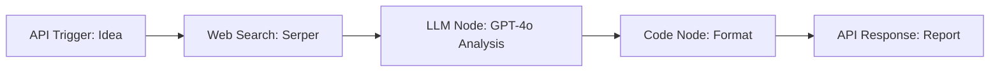

# 📡 Indie Founder Radar

> **AI-Powered Startup Market Validation & Gap Analysis Agent**
> Validate your startup idea before writing code. Scans live web discussions, audits competitor weaknesses, and delivers a data-backed **BUILD ✅** or **SKIP ❌** verdict.

---

## ⚡ Overview

Indie Founder Radar automates early-stage market research for indie hackers and solo founders. Given a startup idea description:
1. **Web Search**: Queries Google via Serper for real discussions, user complaints, and alternative tools.
2. **LLM Market Analysis**: Analyzes pain points, competitor blindspots, ideal customer profiles, and market saturation.
3. **Structured 5-Section Report**:
   - **Top 3 Pain Points** (Real friction users face)
   - **Competitor Weaknesses** (What existing solutions miss)
   - **Target Audience** (Exact ideal customer profile)
   - **Market Opportunity** (Growth vs saturation)
   - **Verdict** (BUILD ✅ or SKIP ❌ + 2-sentence rationale)

---

## 📁 Project Structure

```
kits/indie-founder-radar/
├── apps/                        # Next.js Web Application
│   ├── app/
│   │   ├── api/analyze/route.ts # Lamatic flow API proxy
│   │   ├── globals.css          # Tailwind CSS styles
│   │   ├── layout.tsx           # App root layout
│   │   └── page.tsx             # Interactive dashboard
│   ├── components/
│   │   ├── Header.tsx           # Radar header with live status
│   │   ├── IdeaInput.tsx        # Idea prompt input & presets
│   │   ├── ReportView.tsx       # 5-section report layout
│   │   ├── SectionCard.tsx      # Glassmorphic card component
│   │   └── VerdictBadge.tsx     # BUILD / SKIP badge & markdown exporter
│   ├── lib/
│   │   ├── lamatic-client.ts    # Lamatic GraphQL client
│   │   ├── parse-report.ts      # Markdown/JSON report parser
│   │   └── types.ts             # TypeScript definitions
│   ├── .env.example             # Environment template
│   ├── .env.local               # Local secrets
│   └── package.json
├── flows/
│   └── indie-founder-radar.ts   # Lamatic Flow definition
├── prompts/
│   ├── indie-founder-radar_llmnode-276_system_0.md
│   └── indie-founder-radar_llmnode-276_user_1.md
├── constitutions/
│   └── default.md
├── model-configs/
├── lamatic.config.ts
├── agent.md
└── README.md
```

---

## 🚀 Quick Start & How to Run

### Prerequisites
- Node.js 18+ and npm
- Lamatic account & API key

### 1. Setup Environment
Navigate to the `apps/` directory:
```bash
cd kits/indie-founder-radar/apps
cp .env.example .env.local
```

Configure your credentials in `.env.local`:
```env
LAMATIC_API_URL=https://api.lamatic.ai/graphql
LAMATIC_PROJECT_ID=FactcheckAi595
LAMATIC_FLOW_ID=e4705e2f-5405-4e00-aaf9-7e6263459012
LAMATIC_API_KEY=your_lamatic_api_key_here
```

### 2. Install & Start Development Server
```bash
npm install
npm run dev
```

Open [http://localhost:3000](http://localhost:3000) in your browser.

---

## 🛠️ Flow Architecture


